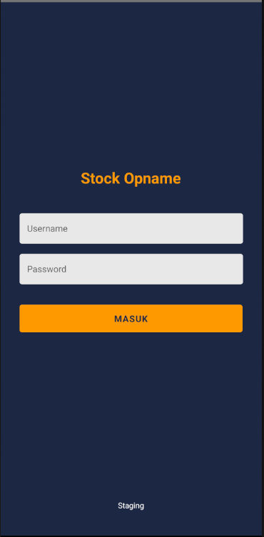
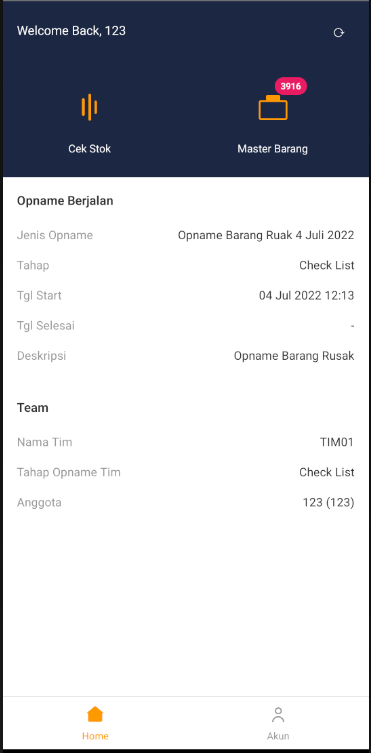
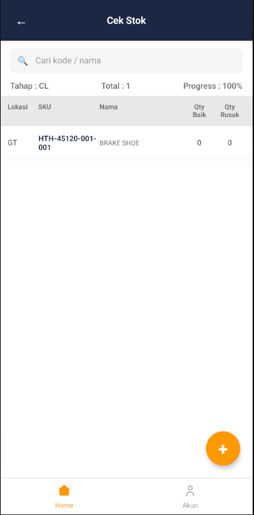
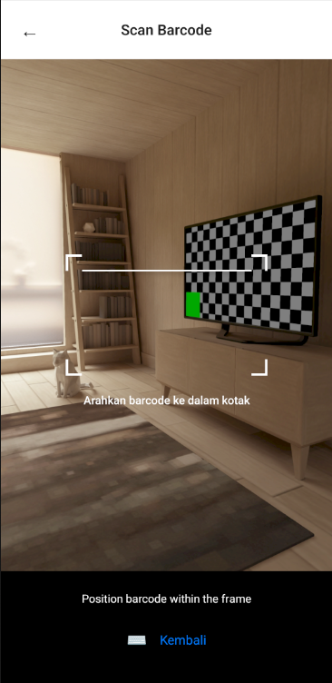
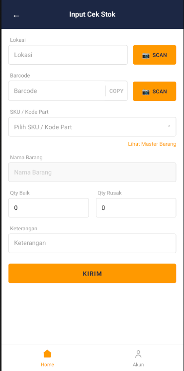
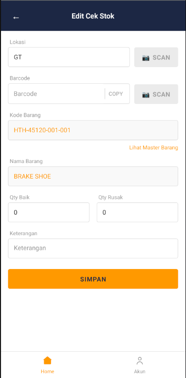
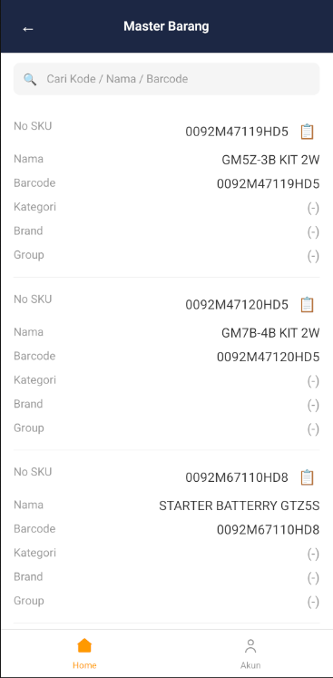
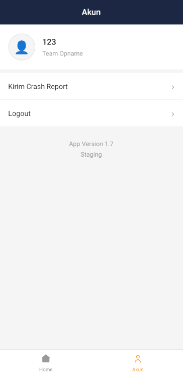

# STOP Mobile

A React Native mobile application for stock management and inventory tracking with barcode scanning capabilities.

## Screenshots

| Login | Home | Stock Check |
|-------|------|-------------|
|  |  |  |

| Barcode Scanner | Input Stock | Edit Stock |
|-----------------|-------------|------------|
|  |  |  |

| Master Barang | Account |
|---------------|---------|
|  |  |

## Features

- **Barcode Scanning**: Fast barcode scanning using react-native-camera-kit
- **Stock Management**: Check and manage inventory stock levels
- **Location Tracking**: Scan location barcodes for accurate tracking
- **Offline Support**: Data persistence with AsyncStorage
- **API Integration**: Real-time sync with backend API

## Tech Stack

- React Native 0.84
- TypeScript
- react-native-vision-camera (Barcode scanning)
- React Navigation
- AsyncStorage

## Prerequisites

- Node.js >= 18
- JDK >= 17
- Android Studio (for Android)
- React Native development environment setup

## Setup Guide

### 1. Clone and Install Dependencies

```bash
# Clone the repository
git clone <repo-url>
cd stopmobilenew

# Install dependencies
npm install
# or
yarn install
```

### 2. Android Setup

```bash
# Navigate to android folder
cd android

# Clean and build
./gradlew clean

# Return to root
cd ..
```

### 3. Configure Environment

Create a `.env` file in the root directory:

```env
API_BASE_URL=https://your-api-url.com
API_TIMEOUT=30000
```

### 4. Run the App

**Development mode:**
```bash
# Start Metro bundler
npm start

# Run on Android (new terminal)
npm run android
# or
npx react-native run-android
```

**Release build:**
```bash
cd android
./gradlew assembleRelease
```

The APK will be at: `android/app/build/outputs/apk/release/app-release.apk`

### 5. Troubleshooting

**Camera permission issues:**
- Ensure `CAMERA` permission is in `AndroidManifest.xml`
- Grant camera permission in app settings

**Metro bundler not connecting:**
```bash
# Reset Metro cache
npm start -- --reset-cache

# Clear watchman
watchman watch-del-all
```

**Build errors:**
```bash
# Clean everything
cd android
./gradlew clean
cd ..
rm -rf node_modules
npm install
cd android
./gradlew assembleDebug
```

## Project Structure

```
src/
├── components/       # Reusable UI components
├── screens/          # Screen components
├── services/         # API services
├── types/            # TypeScript types
├── hooks/            # Custom hooks
└── utils/            # Utility functions
```
